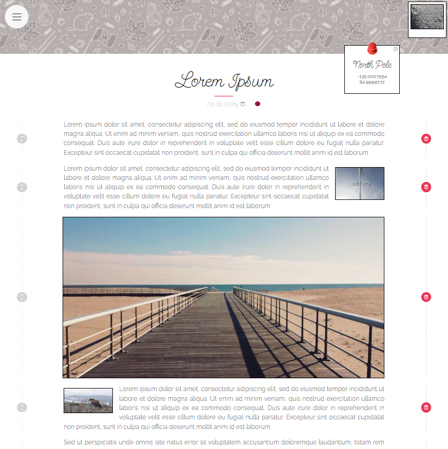

# Text Editor - old ver.    

[link](https://zuzoup.github.io/_text-editor-old/)

The first version of the article editor for my blog. The app lets you write text and add images and YouTube links; it formats the article in a JSON file, that can be downloaded and later used as source data for one of the blog's articles. Data is persisted in local storage and you can also upload .json from files, to continue/edit older articles <em>(currently commented out; it fetches mock data instead)</em>.

